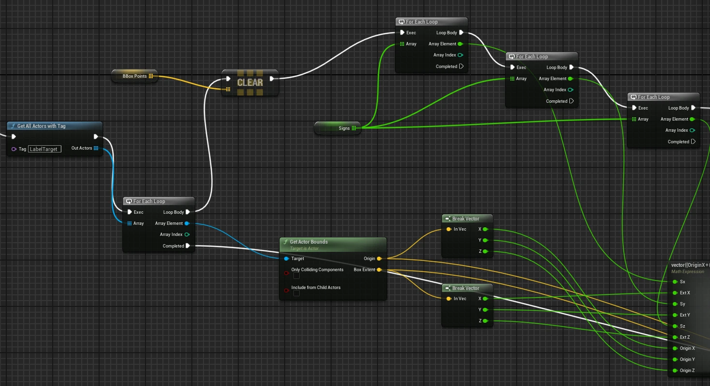

# UE5 蓝图实现 3D 包围盒投影至 2D BBox 技术文档

## 目录

1. [概述](#概述)
2. [前置准备](#前置准备)
3. [核心概念理解](#核心概念理解)
4. [实现步骤详解](#实现步骤详解)
5. [常见问题与陷阱](#常见问题与陷阱)
6. [调试与验证](#调试与验证)
7. [附录](#附录)

---

## 概述

本文档详细记录了在 UE5 中使用纯蓝图实现「3D 包围盒 → 8 角点生成」的完整技术路线。该方案适用于仿真场景中的自动标注、目标检测训练数据生成等应用场景。

### 实现效果展示


*图：3D 包围盒成功渲染效果，绿色线框为 AABB 包围盒，粉色点为 8 个角点*

### 技术路线总览

```
场景 Actor 打标签 → Get All Actors with Tag → ForEach Actor
    → Get Actor Bounds → 生成 8 个角点 → 存入 Array<Vector>
    → 后续处理（投影/标注/Debug）
```

---

## 前置准备

### 1. 创建 LabelManager 蓝图

1. 新建一个 `Blueprint Actor`，命名为 `BP_LabelManager`
2. 将其拖入场景
3. 根据需求选择触发方式：
   - 勾选 `Tick`（Event Tick 中执行）
   - 或按键触发

### 2. 为目标 Actor 添加标签

1. 选中需要标注的目标（船、浮标、码头等）
2. 在 Details 面板最下方找到 **Tags** 区域
3. 添加标签，例如 `"LabelTarget"`

---

## 核心概念理解

### ForEach Loop 节点详解

ForEach Loop 用于遍历数组中的每一个元素，按顺序执行同一段逻辑。

#### 节点结构

| Pin 名称 | 类型 | 含义 |
|---------|------|------|
| Exec | 执行 | 触发循环开始 |
| Array | 数据输入 | 要遍历的数组 |
| Loop Body | 执行输出 | 每遍历一个元素都会执行一次 |
| Array Element | 数据输出 | 当前正在处理的元素 |
| Array Index | 数据输出 | 当前元素的下标（从 0 开始） |
| Completed | 执行输出 | **整个数组遍历完后**只执行一次 |

> ⚠️ **关键理解**：`Completed` 只在整个数组遍历结束后执行一次，不是每次循环后都执行。

#### ForEach Loop 的特性

- **单帧完成**：不是异步的，即使数组有 1000 个元素也会在一帧内全部跑完
- **只能遍历 Array**：不能遍历 Map / Set（它们有专门的节点）

---

### Get Actor Bounds 输出详解

`Get Actor Bounds` 返回的是 **AABB（Axis-Aligned Bounding Box，轴对齐包围盒）**。

#### Origin（中心点）

- 包围盒的**几何中心点**（世界坐标）
- **不是** Actor 的 Pivot 点（建模时的参考点）

#### Box Extent（半尺寸）

- 从中心到盒子六个面的**半长度**
- **不是整长！是一半！**

| 分量 | 含义 |
|-----|------|
| BoxExtent.X | X 方向半宽 |
| BoxExtent.Y | Y 方向半宽 |
| BoxExtent.Z | Z 方向半高 |

#### 数学关系

```
最小角点：Min = Origin - BoxExtent
最大角点：Max = Origin + BoxExtent
实际尺寸 = 2 × BoxExtent
```

#### 「不随旋转」的含义

AABB 的核心特性：**Actor 转了，但包围盒永远和世界坐标轴（X/Y/Z）对齐，不跟着 Actor 一起转。**

实际影响：
- Actor 没旋转时：包围盒紧贴物体
- Actor 旋转 45° 后：包围盒会「变胖」以容纳旋转后的物体

> 💡 如果需要随旋转的包围盒，需要使用 OBB（Oriented Bounding Box），实现复杂度会明显上升。

---

### AABB vs OBB 对比

| 维度 | AABB（Get Actor Bounds） | OBB（随旋转） |
|-----|------------------------|--------------|
| 是否随旋转 | ❌ 不随 | ✅ 随 |
| 参考坐标系 | 世界坐标 | 局部坐标 → 世界坐标 |
| 角点计算 | Origin ± Extent | Local Corner → Transform |
| 蓝图节点数量 | 少 | 明显多 |
| 工程稳定性 | 很高 | 中等 |

**建议**：第一版系统使用 AABB，待遇到精度问题再升级到 OBB。

---

## 实现步骤详解

### Step 1：获取目标 Actor 列表

在 `Event BeginPlay` 或 `Event Tick` 中：

```
Get All Actors with Tag
  └─ Tag = "LabelTarget"
  └─ Out Actors → ForEachLoop
```

> ⚠️ 确保 Tag 不为空，否则 Out Actors 可能是空数组。

---

### Step 2：初始化 Signs 数组

#### 创建变量

在蓝图变量区新建：
- **名称**：`Signs`
- **类型**：Float
- **容器**：Array

#### 在 BeginPlay 中初始化


*图：Event BeginPlay 节点连接，初始化 Signs 数组和获取 LabelTarget Actor*

```
Event BeginPlay
  └─ Clear (Signs)
  └─ Add (Signs)  Item = -1.0
  └─ Add (Signs)  Item = +1.0
```

##### 关于 -1 和 +1 的存储

**不需要**为 -1 和 +1 单独建变量，直接使用 Float 常量即可。

##### UE 如何知道顺序？

Array 是**有序数组**，`Add` 的行为是 **Push Back**（追加到末尾）：
- 执行 `Add -1` 后：`Signs[0] = -1`
- 执行 `Add +1` 后：`Signs[1] = +1`

顺序由**执行先后**决定，100% 确定可预测。

---

### Step 3：创建 BBoxPoints 数组

在蓝图变量区新建：
- **名称**：`BBoxPoints`
- **类型**：Vector
- **容器**：Array

---

### Step 4：正确选择 Add 节点

#### 蓝图中 Add 节点的类型（极易混淆）

| 来源 | 能否用于数组 |
|-----|------------|
| **从数组变量引脚拉出来的 Add** | ✅ 正确选择 |
| Utilities → Array → Add | ✅ 正确（与上面相同） |
| Operators → Add | ❌ 数学加法，不是数组操作 |
| Set → Add / Add Items | ❌ 用于 Set，不是 Array |
| Map → Add | ❌ 用于 Map，不是 Array |
| Target is Kismet Array Library | ✅ 这只是内部实现标识，不影响使用 |

#### 100% 不选错的方法

1. 从变量面板找到数组变量（如 `Signs` 或 `BBoxPoints`）
2. 拖到 Event Graph，选择 **Get**
3. 从数组引脚拉一根线
4. 选择 **Add**

这样 UE 一定知道你要操作的是哪个数组。

#### Add 的 Return Value

`Array.Add` 的返回值是新加入元素的 Index（int 类型）。

在大多数情况下**可以不连接**，除非你需要：
- 立刻用这个 index 做事
- 标记「第几个点」
- 随机访问刚加入的元素

---

### Step 5：正确实现 Float 加法

#### 问题背景

实现 `X = Origin.X + ExtX` 时，需要使用 Float + Float 运算节点。

#### 正确操作方式

**永远从 float 引脚拉线**，不要右键空白处搜索。

1. 找到一个 float 引脚（如 Break Vector → X）
2. 从这个引脚拉一根线
3. 松开鼠标，在搜索框输入 `+`
4. 选择 `+（Float + Float）`

#### 为什么这样做？

- 从 float 引脚出发，UE 已知左操作数是 float
- 只会给你 float + float 选项
- 避免选错为 Vector Add 或其他运算

> 📌 **肌肉记忆**：数学运算节点从来不从空白处找，永远从数据引脚拉。

---

### Step 6：Math Expression 节点（可选方案）

#### 什么是 Math Expression？

在一个节点里写「数学公式」，UE 自动生成加减乘除节点。

#### 如何使用

1. 右键空白处，搜索 `Math Expression`
2. 放置节点后，**单击**（不是双击）节点
3. 在右侧 **Details 面板** 找到 `Expression` 字段
4. 输入公式，然后 Compile

> ⚠️ 公式不是在双击进入的子图里写的！

#### 重要限制：输入只能是标量

Math Expression 的「符号表」只认识标量符号，Vector 必须通过 `vector(x,y,z)` 显式构造。

```
❌ 错误写法：
Origin + vector(sx*ExtX, sy*ExtY, sz*ExtZ)
// Origin 会被解析为 double，导致类型冲突

✅ 正确写法：
vector(OriginX + sx*ExtX, OriginY + sy*ExtY, OriginZ + sz*ExtZ)
// 显式拆分再组装
```

#### 为什么不能直接用 Origin？

Math Expression 是独立的「字符串数学解析器」：
- 在解析阶段不知道外部蓝图的 Pin 类型
- 未声明符号默认当作 scalar（double/float）
- 它和 Blueprint 不共享类型系统

#### 能否在 Math Expression 中写循环？

**不能**。Math Expression 只能写「单次、无状态、纯数学表达式」。

循环这件事必须由 Blueprint 或 C++ 来做。

---

### Step 7：三层 ForEach 实现 8 角点生成

#### 核心思想

```
Signs = [-1, +1]

for sx in Signs:
  for sy in Signs:
    for sz in Signs:
      corner = Origin + (sx*ExtX, sy*ExtY, sz*ExtZ)
      Add corner to BBoxPoints
```

2×2×2 = 8 个角点。

#### sx / sy / sz 不是变量！

它们是 **ForEachLoop 的 Array Element**，是「循环变量」，不需要手动创建。

#### 蓝图实现结构



*图：三层 ForEach 嵌套循环结构，Get Actor Bounds 获取包围盒信息，Break Vector 分解为 X/Y/Z 分量*

```
ForEach Actor (ActorLoop)
  └─ Loop Body
      ├─ Clear BBoxPoints
      ├─ Get Actor Bounds → Origin, BoxExtent
      ├─ Break Vector (Origin) → OriginX, OriginY, OriginZ
      ├─ Break Vector (BoxExtent) → ExtX, ExtY, ExtZ
      │
      └─ ForEach Signs as sx (第1层)
          └─ Loop Body
              └─ ForEach Signs as sy (第2层)
                  └─ Loop Body
                      └─ ForEach Signs as sz (第3层)
                          └─ Loop Body
                              ├─ dx = sx * ExtX
                              ├─ dy = sy * ExtY
                              ├─ dz = sz * ExtZ
                              ├─ Delta = Make Vector(dx, dy, dz)
                              ├─ Corner = Origin + Delta
                              └─ Add Corner to BBoxPoints
```

#### 接线要点

1. **sx/sy/sz 的来源**：
   - 第 1 层 ForEach 的 Array Element → sx
   - 第 2 层 ForEach 的 Array Element → sy
   - 第 3 层 ForEach 的 Array Element → sz

2. **Exec 白线走向**：
   - 第 1 层 Loop Body → 第 2 层 Exec
   - 第 2 层 Loop Body → 第 3 层 Exec
   - 第 3 层 Loop Body → Add(BBoxPoints)

3. **Get Actor Bounds 放置位置**：
   - 放在三层循环**外面**（Actor Loop Body 开始处）
   - 不要放进内层循环，否则会被执行 8 次/Actor

---

### Step 8：Completed 的正确使用

#### 多层 ForEach 时接哪个 Completed？

**规则**：接在「你希望整体完成的那一层」。

| 接在哪里 | 执行次数 |
|---------|---------|
| sz.Completed | 4 次（每个 sy 分支各 1 次） |
| sy.Completed | 2 次（每个 sx 分支各 1 次） |
| **sx.Completed** | **1 次**（8 个点全部完成） |

**结论**：想在 8 个角点全部生成完后做事，接在 **sx 的 Completed** 上。

---

### Step 9：处理 BBoxPoints 数组

#### 关于数据覆盖问题

当前结构中，每个 Actor 处理开始时会 `Clear(BBoxPoints)`，导致最终 BBoxPoints 只保留**最后一个 Actor** 的 8 个点。

**这不是 Bug**，取决于你的需求：

| 目标 | 做法 |
|-----|------|
| 一次只处理一个 Actor | 保持 Clear，在 sx.Completed 后立刻使用 BBoxPoints |
| 保存所有 Actor 的点 | 使用 Map<Actor, Array<Vector>> 或不 Clear |

---

## 常见问题与陷阱

### 问题 1：Get Actor Bounds 没有 Exec，怎么控制执行次数？

`Get Actor Bounds` 是 **Pure Node**（纯数据节点）：
- 没有白色 Exec 引脚
- 只要它的输出被用到，UE 就会在需要时计算

**最佳实践**：用 `Set` 节点缓存结果

```
Set OriginCached = GetActorBounds.Origin
Set ExtentCached = GetActorBounds.BoxExtent
```

然后在循环内部使用缓存变量，避免重复求值。

---

### 问题 2：Array<Vector> 怎么连接到 Draw Debug Point？

`Draw Debug Point` 只接受单个 Vector，不能直接接 Array。

**解决方案**：使用 ForEachLoop 遍历

```
ForEachLoop (BBoxPoints)
  └─ Loop Body
      └─ Draw Debug Point
          └─ Position = Array Element
```

---

### 问题 3：如何只取数组的第一个元素？

不要用 ForEachLoop，使用 **Get (a copy) + Index = 0**：

1. 从 BBoxPoints 变量拖出来选 Get
2. 从数组引脚拉线，选 `Get`
3. Index 设为 `0`
4. Return Value 就是第一个 Vector

**安全写法**（防止空数组）：
```
Length(BBoxPoints) > 0
  ├─ True → Get[0] → 使用
  └─ False → 什么都不做
```

---

### 问题 4：ForEach vs ForLoop + 位运算

| 维度 | ForEach | ForLoop + 位运算 |
|-----|---------|-----------------|
| 可读性 | ⭐⭐⭐⭐⭐ | ⭐⭐ |
| 数学门槛 | ⭐ | ⭐⭐⭐⭐ |
| 蓝图友好度 | ⭐⭐⭐⭐⭐ | ⭐⭐ |
| 节点数量 | 一般 | 最少 |
| Debug | ⭐⭐⭐⭐⭐ | ⭐⭐ |

**建议**：开发期用 ForEach，稳定期可封装为 ForLoop + 位运算。

---

### 问题 5：Math Expression vs Blueprint Function

| 维度 | Math Expression | Blueprint Function |
|-----|----------------|-------------------|
| 解决的问题 | 怎么写得不丑 | 怎么让工程不乱 |
| 关注点 | 表达能力 | 结构与可维护性 |
| 适合阶段 | 探索/原型 | 稳定功能/多次复用 |

**最佳实践**：两者结合使用
- Math Expression 作为内核解决「怎么算」
- Blueprint Function 作为外壳解决「放哪、怎么复用」

---

## 调试与验证

### 验证方法 1：Draw Debug Point（验证 8 角点）

在 sx.Completed 后：


*图：Math Expression 节点计算角点坐标，Draw Debug Point 和 Draw Debug Box 用于可视化验证*

```
ForEachLoop (BBoxPoints)
  └─ Draw Debug Point
      ├─ Position = Array Element
      ├─ Size = 10~20
      ├─ Color = Red
      └─ Duration = 5 秒
```

**预期效果**：8 个红点出现在物体包围盒的 8 个角上。

---

### 验证方法 2：Draw Debug Box（验证 AABB）

在 Actor Loop Body 中：

```
Draw Debug Box
  ├─ Center = Origin (GetActorBounds 输出)
  ├─ Extent = BoxExtent (GetActorBounds 输出)
  ├─ Rotation = (0,0,0)
  └─ Duration = 5 秒
```

**预期效果**：一个线框盒子包裹住物体。

---

### 验证方法 3：组合验证

同时执行方法 1 和方法 2：
- 如果 8 个点**刚好落在盒子的 8 个角上**
- 说明整个 AABB → 8 点逻辑 **100% 正确**

---

### 验证方法 4：Print String 验证循环变量

在最内层 Loop Body 添加：

```
Print String: "sx={sx}, sy={sy}, sz={sz}"
```

**预期输出**：8 组不同的 ±1 组合。

如果看到 sx/sy/sz 有 0 或其它值，说明接线没用到循环输出。

---

## 附录

### 8 角点符号对照表

| 点 | X | Y | Z |
|---|---|---|---|
| p0 | +ExtX | +ExtY | +ExtZ |
| p1 | +ExtX | +ExtY | -ExtZ |
| p2 | +ExtX | -ExtY | +ExtZ |
| p3 | +ExtX | -ExtY | -ExtZ |
| p4 | -ExtX | +ExtY | +ExtZ |
| p5 | -ExtX | +ExtY | -ExtZ |
| p6 | -ExtX | -ExtY | +ExtZ |
| p7 | -ExtX | -ExtY | -ExtZ |

---

### 完整蓝图结构文字版

```
BeginPlay:
  Clear Signs
  Add Signs -1
  Add Signs +1

Event Tick / 按键触发:
  Get All Actors with Tag ("LabelTarget")
    └─ ForEach Actors (ActorLoop):
        ├─ Clear BBoxPoints
        ├─ Get Actor Bounds
        │    └─ Break Origin → OriginX/Y/Z
        │    └─ Break Extent → ExtX/Y/Z
        │
        └─ ForEach Signs as sx:
            └─ ForEach Signs as sy:
                └─ ForEach Signs as sz:
                    ├─ dx = sx * ExtX
                    ├─ dy = sy * ExtY
                    ├─ dz = sz * ExtZ
                    ├─ Corner = Origin + MakeVector(dx,dy,dz)
                    └─ Add Corner to BBoxPoints

        sx.Completed:
            └─ ForEach BBoxPoints:
                └─ Draw Debug Point (验证)
            └─ 后续处理（投影/标注等）
```

---

### 工程级经验总结

1. **数组操作**：永远先拖数组变量，再从它拉 Add/Get/Clear
2. **数学运算**：永远从数据引脚拉线，不从空白处搜索
3. **Pure Node**：没接的输出 = 不关心这个返回结果
4. **Completed**：多层循环时，接在「你希望整体完成的那一层」
5. **Math Expression**：只把它当「标量驱动的数学公式工具」，不要当代码块
6. **验证优先**：先 Draw Debug 验证逻辑正确，再进行后续开发

---

*文档版本：1.0*
*适用引擎：Unreal Engine 5.x*
*最后更新：基于实际开发对话整理*
